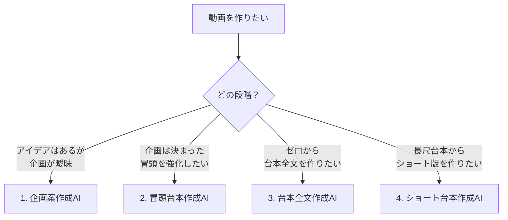

# **える式台本生成AIエージェント ZERO クイックスタート＆実践ガイド（ベスト版）**

執筆：担当エンジニアSHUN（統合版）

## **📌 はじめに**

**ツールURL:** [https://youtube-content-gen.vercel.app/](https://youtube-content-gen.vercel.app/)

> 初回アクセス時はベーシック認証が必要です。別途案内のユーザー名とパスワードを入力してください。

---

## **全体像（まずは3分で把握）**

### **🎯 機能選択フロー**

### **🚀 2本の標準ルート**
- **新規で1本作る:** 企画案作成AI → 冒頭台本作成AI → 台本全文作成AI → ドキュメント編集 → ショート台本作成AI
- **既存台本を強化:** 冒頭台本作成AI → ドキュメント編集（AI編集アシスト）

---

## **初期設定（5分で完了）**

### **STEP 1: アカウント作成**
1. [ツールURL](https://youtube-content-gen.vercel.app/)へアクセス
2. ログイン画面下部の「新規登録」をクリック
3. メールとパスワード（8文字以上）を入力 → 登録

| ログイン画面 | 新規登録画面 |
|------------|------------|
|  |  |

### **STEP 2: 発信者情報（推奨）**
1. 画面左下のメールアドレス →「マイページ」
2. プロフィールを入力 →「保存する」

| 設定画面への入り口 | 設定画面 |
|-----------------|---------|
|  |  |

> 💡 ポイント: 詳細に入力するほど精度は上がりますが、ここに時間をかけすぎないでOK（将来的に自動精度UPも開発中）。

---

## **4つの作成AI 概要と最短手順**

### **1️⃣ 企画案作成AI**
**目的:** アイデアを対話で具体化し、使える企画案に整える。

**最短手順**
1. 左メニュー「企画案作成AI」
2. アイデアを送信（例: 「○○のノウハウを伝えたい」）
3. AIの質問に3〜5往復で回答 → 企画案が完成

**Tips**
- Web検索はしません。あなたの経験・考えを素材にします。
- 企画案は次の「冒頭」や「全文」でそのまま利用可能。

**使用例・デモ**
- [企画作成の実例](https://youtube-content-gen.vercel.app/chat/3e6a4f5b-a42a-42ae-8960-083631875ce7)
- [作成した企画で冒頭を生成](https://youtube-content-gen.vercel.app/chat/07284908-48bc-4942-ad10-50b96914cd0b)
- デモ動画：

<iframe src="https://www.loom.com/embed/bd9d1294dfbd4ac1a0340b2ad105c52b?sid=912e316d-8677-4efe-bd37-b1237a825d63" frameborder="0" webkitallowfullscreen mozallowfullscreen allowfullscreen style="position: absolute; top: 0; left: 0; width: 100%; height: 100%;"></iframe>

---

### **2️⃣ 冒頭台本作成AI**
**目的:** 最重要の「掴み」を複数パターンで高速に最適化。

**最短手順**
1. 左メニュー「冒頭台本作成AI」
2. 企画案または台本全文/一部を貼り付け
3. 台本設計（ターゲット/訴求）を確認 → OK/修正
4. A/B/C案から選択 or 追加修正指示

| 入力画面 | 台本設計 | 選択画面 |
|---------|---------|---------|
|  |  |  |

**Tips**
- 視聴者の悩み/理想は未入力でもOK（AIが推察）。
- 「考えています」表示中はリロード厳禁。

---

### **3️⃣ 台本全文作成AI**
**目的:** 冒頭〜エンディングまでの完全台本を、2段階アウトラインで論理設計して生成。

**重要な前提**
- ⚠️ 完全ゼロ自動生成は不可。属人性を保つため、必ずあなたの考え（企画案）を入力し、合意を経て生成します。

**最短手順**
1. 左メニュー「台本全文作成AI」→ 企画案を入力
2. フェーズ1：戦略設計（ターゲット/コアアイデア/戦略）を確認・修正
3. フェーズ2：論理設計（冒頭/本編/行動促進）を確認・修正
4. 「✅この内容で確定・台本生成開始」→ 2〜3分で出力

| アウトライン確認 | 生成結果 |
|----------------|---------|
|  |  |

**Tips**
- 企画種別は自動判定。誤判定時はチャットで修正指示。

---

### **4️⃣ ショート台本作成AI**
**目的:** 長尺台本から、ターゲット別に最適化したショート台本を複数生成。

**最短手順**
1. 左メニュー「ショート台本作成AI」
2. 長尺台本の全文を貼り付け → 作成
3. ペルソナ分析を確認 → OK/修正
4. ショート台本案を確認 → 必要なら修正指示

---

## **ドキュメント編集（仕上げと管理）**

### **編集方法は3つ**
1. **手動編集:** 直接修正 → 保存ボタンを押す（自動保存は未実装）
2. **AI編集アシスト:** 範囲選択 → 指示 → 差分確認 → 承認/却下
3. **バージョン管理:** 版の切替・復元が可能

| 手動編集 | AI編集の差分確認 | バージョン管理 |
|---------|----------------|--------------|
|  |  |  |

> ⚠️ 注意: AIが選択範囲の前後も調整する場合があります。必ず「変更点を表示」で差分を確認してから承認してください。

---

## **ベストプラクティス（短く強く）**
- **機能選択を誤らない:** 企画相談は「企画案作成AI」、冒頭強化は「冒頭台本作成AI」。
- **指示は1つずつ:** 要求の同時投げは精度低下の元。短く具体的に。
- **会話をダラダラ続けない:** 詰まったら新規チャットへ切替。
- **あなたの独自性を入れる:** 具体エピソード・実績・失敗談は訴求力を上げる。

---

## **トラブルシューティング**

| 症状 | よくある原因 | 対処 |
|------|--------------|------|
| 生成が止まる/遅い | リロードや再送 | 画面操作を控え、数分待つ。改善しなければ再試行 |
| 思った構成にならない | 機能選択ミス/指示過多 | 機能を目的別に使い分け、指示を1つに絞って再トライ |
| 事実誤りがある | AIのハルシネーション | 公開前に必ずファクトチェック、必要箇所をAI編集で修正 |
| 既視感が強い | 完全自動期待 | あなたの経験/視点を明示し、アウトラインで合意を取る |

---

## **FAQ**

**Q. 教材のニューロボルトライティング（導入①〜⑦）固定構成で生成できる？**  
A. 現状は非対応。固定構成は既視感を生みやすく、売上につながりにくいため。テンプレ要素は尊重しつつ、テーマに合わせ柔軟に最適化します。

---

## **サポート**

- Discordサポートチャンネルへご連絡ください（ログイン不可、出力停止など）。通常24時間以内に返信。

---

## **付録：参考リンク**
- 企画作成の実例: `https://youtube-content-gen.vercel.app/chat/3e6a4f5b-a42a-42ae-8960-083631875ce7`
- 企画→冒頭の実例: `https://youtube-content-gen.vercel.app/chat/07284908-48bc-4942-ad10-50b96914cd0b`

※ 本ガイドは随時アップデートします。
