# ZEROご利用開始ガイド

このガイドのゴールは、**プロフィール設定を完了し、ZEROの各機能を使える状態にすること**です。

ZEROでは、プロフィール情報をもとに伸びる企画の提案・台本生成を行います。
ここの精度が企画・台本の質に直結しますので、丁寧に設定してください。

---

# Step 1：ZEROにアクセスする

以下のURLからZEROにアクセスしてください。

[https://youtube-content-gen.vercel.app/](https://youtube-content-gen.vercel.app/)

- アカウントをお持ちの方はそのままログインしてください
- アカウントをまだお持ちでない方は「**新規登録**」からアカウントを作成してください

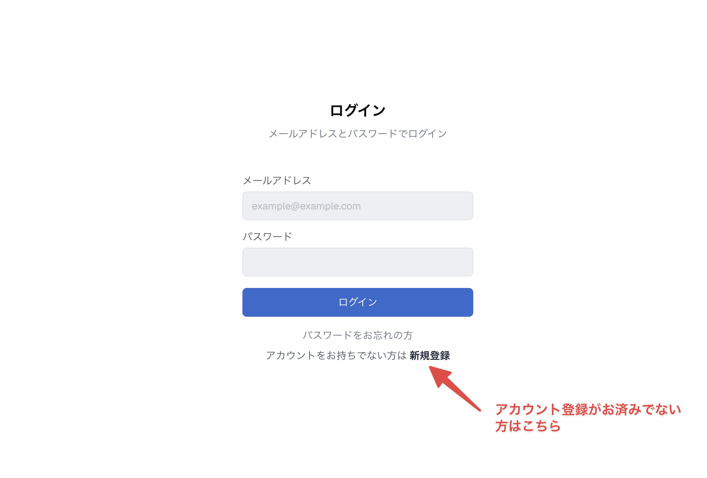

---

# Step 2：プロフィールを設定する

新規登録の方はログイン後に自動的にプロフィール設定画面が開きます。
既にアカウントをお持ちの方は、トップ画面に表示されるバナー、またはサイドバーの「**マイページ**」から設定画面に進めます。

| トップ画面のバナー | サイドバーのマイページ |
|------------------|-------------------|
| 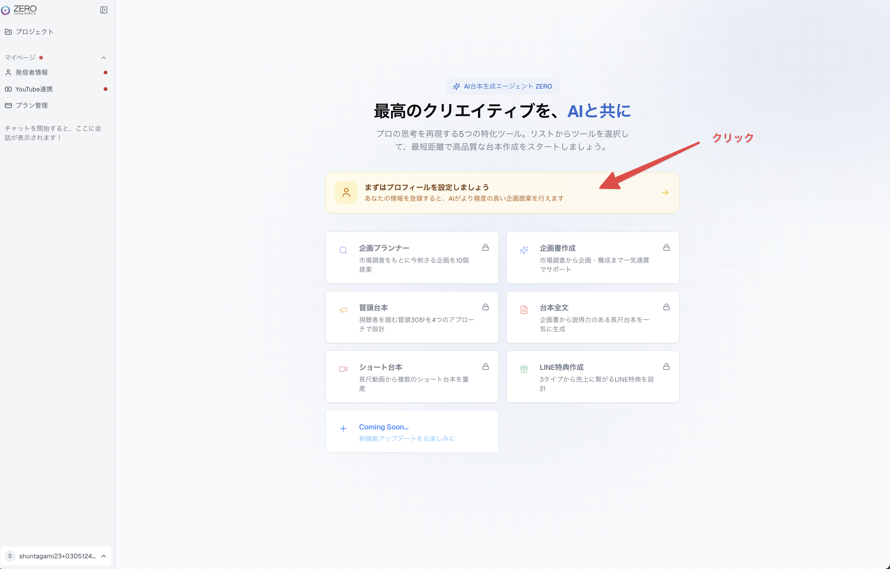 | 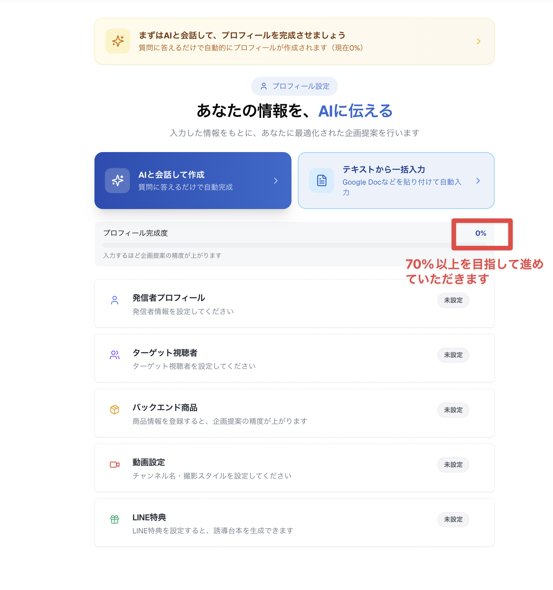 |

入力方法は以下の2種類から選べます。

- **方法1：AIとの会話形式**（おすすめ）
- **方法2：お手持ちのドキュメントからコピペ**（既にGoogle Docなどでまとめている方向け）

**LINE特典以外の項目はすべて入力をお願いします。**
LINE特典は企画提案の段階では不要なので、台本作成に進む際に入力していただければ大丈夫です。

## 方法1：AIとの会話形式（おすすめ）

「**会話を始める**」ボタンを押すと、AIアシスタントZEROが質問をしてくれます。
質問に答えていくだけで、自動的にプロフィールが作成されます。

入力方式は3つから選べます。

- **AIと音声会話**（おすすめ）：ZEROと直接話しながら登録。最も手軽です
- **音声で入力**：話した内容をテキストに変換して送信
- **テキストで入力**：キーボードで入力

| 入力方式の選択 | 音声会話を選択 |
|-------------|-------------|
| 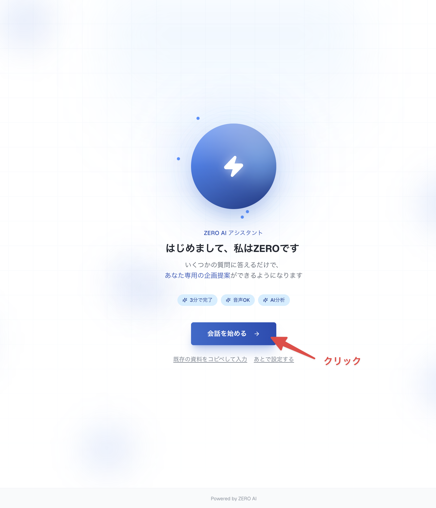 | 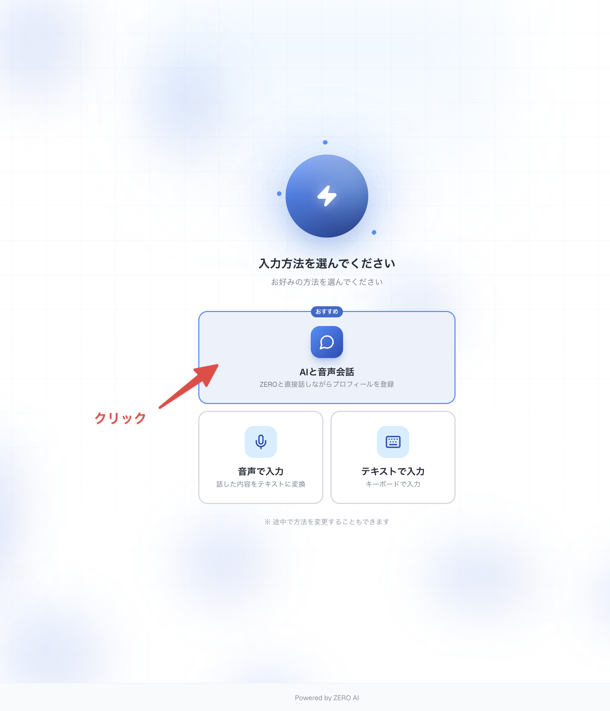 |

以下の操作でZEROとの対話を進めることができます。
質問への回答が可能な箇所はできる限りお願いします。

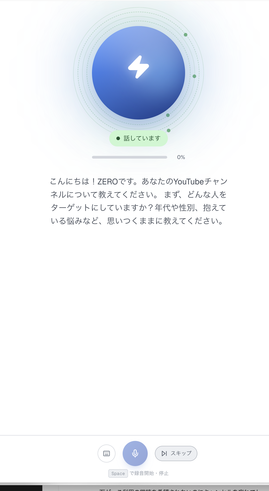

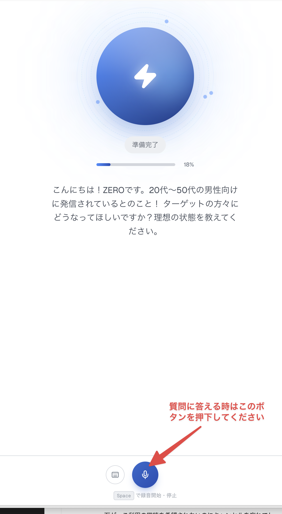

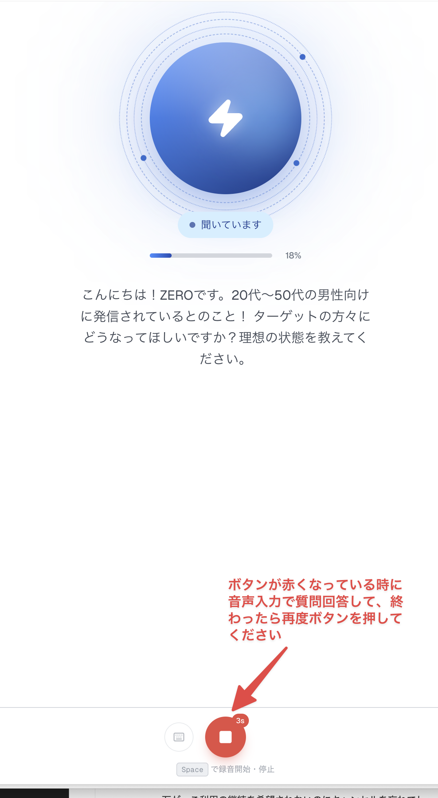

**途中で中断しても大丈夫です。**
×ボタンで閉じても入力済みの内容は保存されます。後から再開すると、続きから入力できます。

## 方法2：お手持ちのドキュメントからコピペ

ご自身の活動内容を既にGoogle Docなどの文章としてまとめている場合は、「**既存の資料をコピペして入力**」を選択してください。
テキストを貼り付けるだけで、AIが各項目に自動で振り分けます。

| コピペ方式を選択 | テキストを貼り付け |
|---------------|----------------|
| 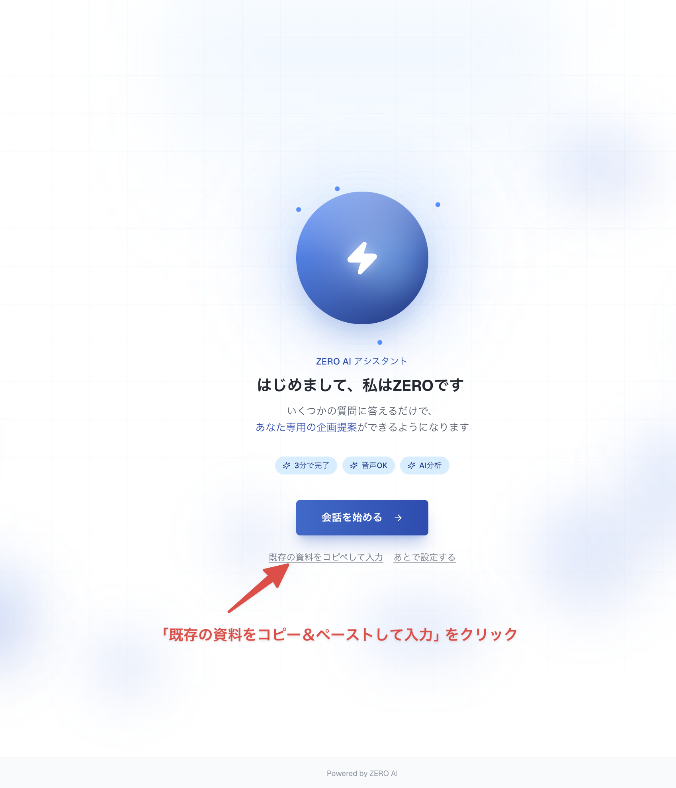 | 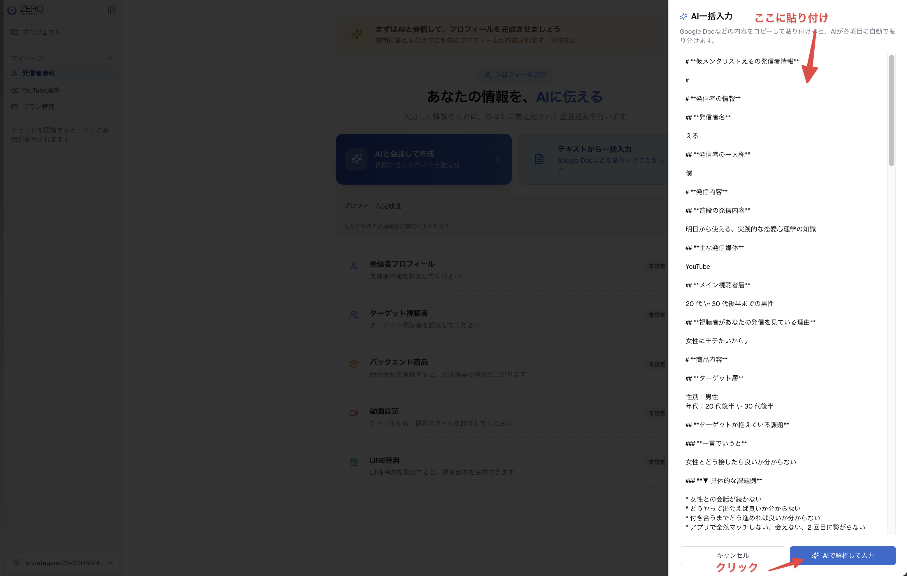 |

---

# Step 3：クレジットカードを登録して利用を開始する

プロフィール設定後、各機能を使うにはクレジットカードの登録が必要です。

**1.** 左サイドバーの「**プラン管理**」をクリック

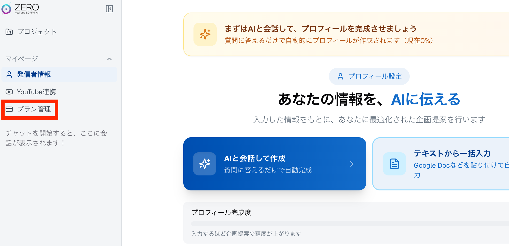

**2.** 「**無料トライアルを開始する**」をクリック

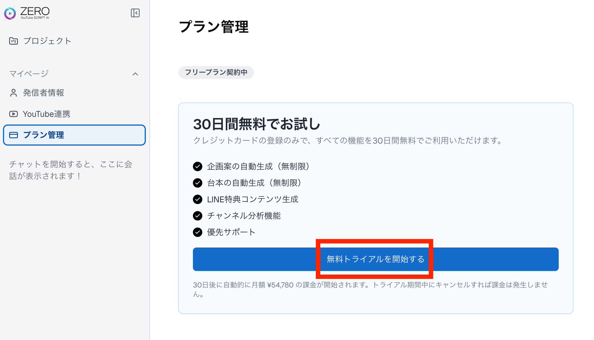

**3.** お客様情報（メールアドレス、電話番号）を入力 →「**次へ**」→ カード情報を入力 →「**送信**」

| お客様情報入力 | カード情報入力 |
|-------------|-------------|
| 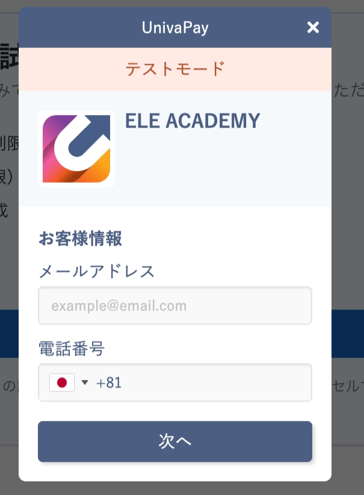 | 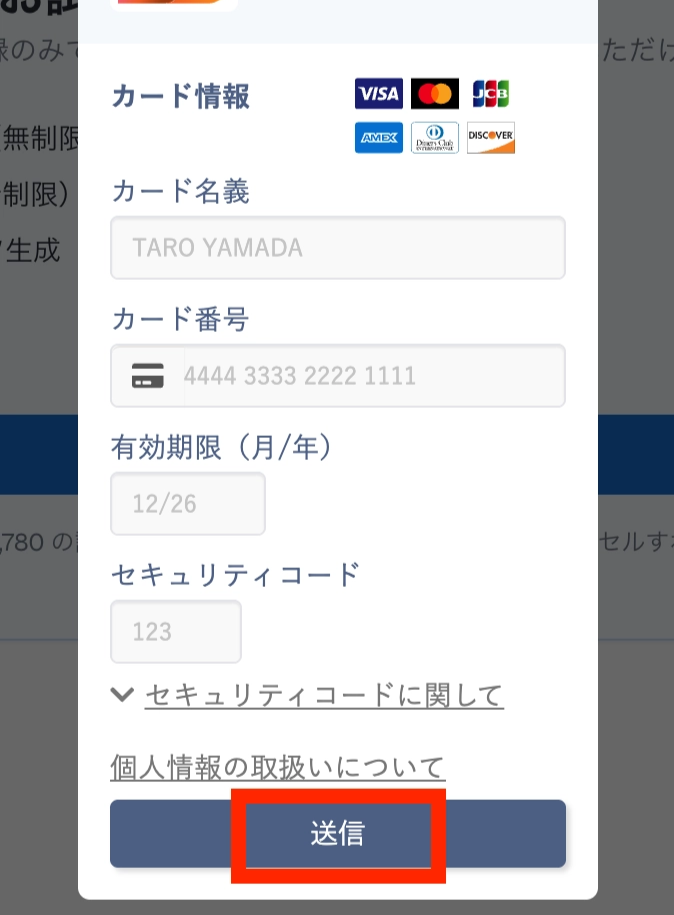 |

**4.** 登録完了後、「**無料トライアル中**」と表示されます

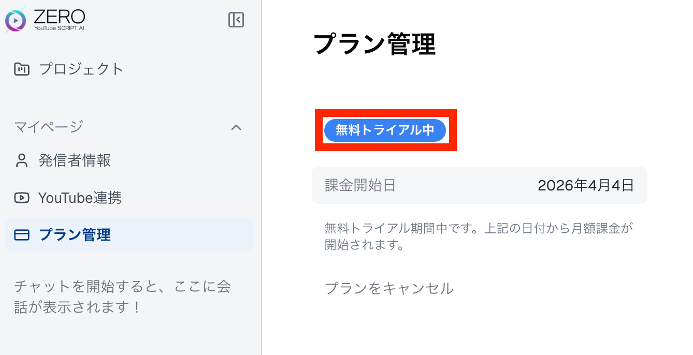

### 注意点

- 1ヶ月の無料期間中、キャンセルはいつでも可能です
- キャンセルするとその時点でサービスがご利用できなくなりますのでご注意ください
- 万が一ご利用の継続を希望されないのにキャンセルを忘れてしまって決済されてしまった場合には返金対応いたしますので、その点はご安心ください

---

# Step 4：各機能の利用を開始する

まだ台本のテーマが決まっていない場合には是非、「**企画プランナー**」の機能からお試しください。

各機能の詳しい使い方は[活用ガイド](manual)をご覧ください。

---

# お問い合わせ先

Discordの個人チャンネルで`@える`または`@STAFF SHUN`までお気軽にご連絡ください。

## YouTube・コンテンツの内容に関すること → `@える`

企画や台本の「中身」に関する判断はえるまでご質問ください。

- 企画プランナーで出てきた企画のうち、どれを選ぶべきか
- 作成した台本の構成や訴求がこれで良いか
- 自分のジャンル・商品に合った切り口が分からない
- LINE特典の内容をどう設計すべきか

## ZEROの操作・契約に関すること → `@STAFF SHUN`

ZEROの「使い方」や契約に関することはSTAFF SHUNまでご連絡ください。

- 台本の一部をAIで修正する方法が分からない
- 長尺台本からショート台本を生成する手順を知りたい
- エラーが出て先に進めない
- クレジットカードの登録・キャンセル方法を知りたい
- パスワードを忘れてしまったのでリセットしたい
