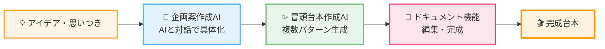

# **える式台本生成AIエージェント ZERO 活用ガイド**

## **本ドキュメントの概要**

「える式台本生成AIエージェント ZERO」は、YouTube動画の企画立案から台本作成までをサポートするAIツールです。

AIとの対話を通じてアイデアを具体的な企画に仕上げ、視聴者の悩みを分析して「刺さる」冒頭台本を生成します。このガイドでは、ZEROの基本的な使い方を解説します。

**ツールURL:** [https://youtube-content-gen.vercel.app/](https://www.google.com/search?q=https://youtube-content-gen.vercel.app/)

---

## **目次**

1.  [準備編：はじめの設定](#準備編はじめの設定)
    - [1-1. アカウント作成とログイン](#1-1-アカウント作成とログイン)
    - [1-2. 【重要】発信者情報の設定](#1-2-発信者情報の設定)
2.  [実践編：AIで企画と台本を作る](#実践編aiで企画と台本を作る)
    - [ZEROの全体フロー](#zeroの全体フロー)
    - [2-1. 企画案作成AI：アイデアを具体化する](#2-1-企画案作成aiアイデアを具体化する)
    - [2-2. 冒頭台本作成AI：引き込む導入を作る](#2-2-冒頭台本作成ai引き込む導入を作る)
    - [2-3. ドキュメント機能：台本を仕上げる](#2-3-ドキュメント機能台本を仕上げる)
3.  [注意事項とサポート](#注意事項とサポート)

---

## **準備編：はじめの設定**

### **1-1. アカウント作成とログイン**

クリックして開く

[ツールURL](https://youtube-content-gen.vercel.app/)にアクセスし、アカウントを作成します。

1.  ログイン画面下部の「**新規登録**」リンクをクリックします。
2.  メールアドレスとパスワード（8文字以上）を入力し、「**登録**」ボタンをクリックします。
3.  登録完了後、自動的にログインします。

| ログイン画面 | 新規登録画面 |
| --- | --- |
|  |  |

### **1-2. 発信者情報の設定**

クリックして開く

よりパーソナライズされた台本を作成するために、「発信者情報」の設定を推奨します。（後から設定も可能です）

1.  ログイン後、画面左下の**自分のメールアドレス**をクリックします。
2.  表示される「**マイページ**」ボタンをクリックします。
3.  発信者情報を入力し、「**保存する**」をクリックします。

| 発信者情報の設定をクリック | 発信者情報の設定画面 |
| --- | --- |
|  |  |

**💡 ポイント**
入力は任意ですが、詳細に入力するほど、AIはあなたの特徴や強みを理解し、より的確な台本を提案できるようになります。

---

## **実践編：AIで企画と台本を作る**

### **ZEROの全体フロー**

ZEROは、以下の3ステップで台本作成をサポートします。

### **2-1. 企画案作成AI：アイデアを具体化する**

クリックして開く

「なんとなくこんな動画を作りたい」というアイデアレベルの状態から、AIとの対話を通して企画を具体化します。

1.  左メニューの「**企画案作成AI**」をクリックします。
2.  思いついたアイデアをチャットで送信します。
3.  AIが質問を投げかけるので、対話を繰り返します。

対話を通じて、AIは「視聴者の悩み」「独自の解決策」などを言語化し、最終的に企画案としてまとめます。ここで作成した企画案は、そのまま「冒頭台本作成AI」で利用できます。

| 企画案の完成イメージ |
| --- |
|  |

**▼使用例**

実際の使用例を見るとイメージが湧きやすくなります。（※閲覧にはログインが必要です）

- [企画作成AIの使用例](https://youtube-content-gen.vercel.app/chat/3e6a4f5b-a42a-42ae-8960-083631875ce7)
- [上記企画で冒頭台本を作成する例](https://youtube-content-gen.vercel.app/chat/07284908-48bc-4942-ad10-50b96914cd0b)

### **2-2. 冒頭台本作成AI：引き込む導入を作る**

クリックして開く

企画案や既存の台本を元に、AIが視聴者を引き込む強力な冒頭台本を複数パターン提案します。

#### **ステップ 1：情報の入力**

1.  左メニューの「**冒頭台本作成AI**」をクリックします。
2.  入力フォームに必要な情報を入力します。

| 項目 | 説明 |
| --- | --- |
| **台本の全文または冒頭を含む一部分（必須）** | 元となる内容（企画案や既存の台本）を入力します。 💡 _Tip: 全文を入力した方が精度は高まります。_ |
| 視聴者の抱える悩み（任意） | 未入力の場合、AIが推察します。 |
| 悩みを解決した後の理想の姿（任意） | 未入力の場合、AIが推察します。 |

| 入力フォーム画面 |
| --- |
|  |

#### **ステップ 2：作成の実行と台本設計の確認**

1.  入力完了後、「**冒頭台本を作成する**」ボタンをクリックします。チャット画面に移動します。
    - ⚠️ **注意:** 「考えています」の表示中は、画面のリロード等をしないでください。処理が中断されます。
2.  AIが入力内容を分析し、「**台本設計**（ターゲット、訴求方法など）」を提示します。
3.  内容を確認し、問題なければ「OK」などと入力して送信します。修正したい場合は、ここで指示を出します。

| 台本設計の確認画面 | 台本設計への返答画面 |
| --- | --- |
|  |  |

#### **ステップ 3：結果の確認と選択**

AIが分析に基づき、異なる訴求パターンで**最大3つの冒頭台本案**を提示します。

1.  提案された台本案（A案、B案、C案）を確認します。
2.  最適な案を選択します。
    - **確定する場合:** 「**A案でお願いします**」などのボタンをクリックすると、ドキュメント形式で出力されます。
    - **修正する場合:** チャット欄に追加の指示を入力します。（例：「A案を、もっと〇〇なトーンで修正して」）

| 台本案の選択画面 |
| --- |
|  |

### **2-3. ドキュメント機能：台本を仕上げる**

クリックして開く

ドキュメント機能では、生成された台本の編集と管理が可能です。

- **直接編集:** 生成された台本をマークダウン形式で直接編集できます。
- **AIによる編集:** 修正点を伝えてAIに編集を依頼できます。
- **バージョン管理:** 編集履歴を保存し、過去のバージョンに戻すことができます。

**🎬 動画で使い方を確認する**

機能が豊富なため、以下の解説動画をご覧ください。

[ドキュメント機能 解説動画 (Loom)](https://www.google.com/search?q=https://www.loom.com/share/1cdf9add0b494881bd729ccbbe3ac5a6%3Fsid%3Ddd24e410-79c4-49a4-9472-31d347bebfdd)

**⚠️ AIに編集を依頼する際の重要操作**

AIに指示を出して台本を修正させる場合は、必ず「📝**修正点を伝えて台本を更新**」ボタンを押してください。（※現在、仕様改善を検討中です）

| AI編集ボタンの位置 |
| --- |
|  |

---

## **注意事項とサポート**

### **AIの出力について**

- AIは事実と異なる内容（ハルシネーション）を生成する場合があります。
- AIの出力は訴求の参考として活用し、公開前には必ずご自身で内容（特に事実関係）を確認・修正してください。

### **AIを効果的に使うためのポイント**

#### **適切な機能を選ぶ**

各AIには得意な役割があります。目的に応じて使い分けましょう：

- **企画案作成AI** → アイデアの壁打ち・企画の具体化
- **冒頭台本作成AI** → 視聴者を引き込む冒頭部分の生成
- **ドキュメント機能** → 台本の編集・調整

> 💡 **NG例：** 冒頭台本作成AIで企画相談をする → 本来の用途と異なるため、期待する結果が得られません

#### **指示は明確かつシンプルに**

AIへの指示は以下の点に注意しましょう：

- **一度に複数の要求をしない** - 「〇〇と△△と□□を全部やって」ではなく、一つずつ指示する
- **具体的に伝える** - 「もっと良くして」ではなく「冒頭をもっと短く、30秒以内にして」など
- **長いやり取りは避ける** - 会話が長くなると精度が落ちる場合があります。必要に応じて新しいチャットを開始してください

#### **AIの限界を理解する**

現在のAIには以下の制限があります：

- **最新情報の取得不可** - インターネット検索はできません（最新ニュースやトレンドは反映されません）
- **完璧ではない出力** - 満足いく結果が得られない場合もあります。その際は指示を変えて再度お試しください
- **文脈の長さに限界** - 長い会話や大量のテキストを扱うと、精度が低下することがあります

### **トラブルシューティング・お問い合わせ**

「ログインできない」「出力が途中で止まった」などの不具合がございましたら、Discordのサポートチャンネルにてスタッフまでお気軽にお知らせください。
