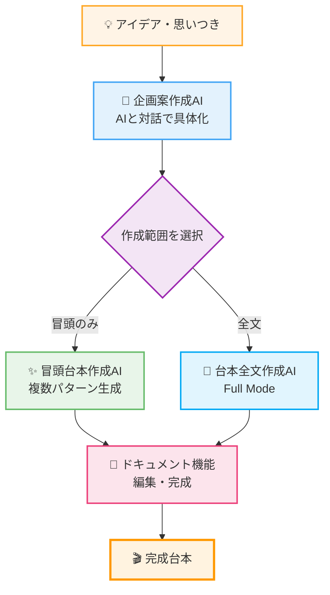

# **える式台本生成AIエージェント ZERO 活用ガイド**

執筆：担当エンジニアSHUN

## **本ドキュメントの概要**

「える式台本生成AIエージェント ZERO」の利用方法をまとめたドキュメントです。

利用開始前に必ずご一読ください。

**ツールURL:** [https://youtube-content-gen.vercel.app/](https://youtube-content-gen.vercel.app/)

※ URLを最初に開いた際にはベーシック認証が求められます。  
別途案内しているユーザー名とパスワードをご入力ください。

## **重要事項**

ZEROは「冒頭生成」と「台本全文生成（Full Mode）」の2つの機能を提供しています。
それぞれ異なる用途に最適化されているため、目的に応じて使い分けてください。
必ず、マニュアルに目を通した上でご利用ください。

---

## **目次**

1.  [準備編：はじめの設定](#準備編はじめの設定)
    - [アカウント作成とログイン](#アカウント作成とログイン)
    - [【重要】発信者情報の設定](#重要発信者情報の設定)
2.  [実践編：AIで企画と台本を作る](#実践編aiで企画と台本を作る)
    - [ZEROの全体フロー](#zeroの全体フロー)
    - [企画案作成AI](#企画案作成ai)
    - [冒頭台本作成AI](#冒頭台本作成ai)
    - [台本全文作成AI（Full Mode）](#台本全文作成aifull-mode)
    - [ドキュメント機能](#ドキュメント機能)
3.  [注意事項とサポート](#注意事項とサポート)
4.  [よくある質問](#よくある質問)

---

## **準備編：はじめの設定**

### **アカウント作成とログイン**

クリックして開く

[ツールURL](https://youtube-content-gen.vercel.app/)にアクセスし、アカウントを作成します。

1.  ログイン画面下部の「**新規登録**」リンクをクリックします。
2.  メールアドレスとパスワード（8文字以上）を入力し、「**登録**」ボタンをクリックします。
3.  登録完了後、自動的にログインします。

| ログイン画面                                                                                     | 新規登録画面                                                                                     |
| ------------------------------------------------------------------------------------------------ | ------------------------------------------------------------------------------------------------ |
|  |  |

### **【重要】発信者情報の設定**

クリックして開く

よりパーソナライズされた台本を作成するために、「発信者情報」の設定を推奨します。（後から設定も可能です）

1.  ログイン後、画面左下の**自分のメールアドレス**をクリックします。
2.  表示される「**マイページ**」ボタンをクリックします。
3.  発信者情報を入力し、「**保存する**」をクリックします。

| 発信者情報の設定をクリック                                                                                     | 発信者情報の設定画面                                                                                     |
| -------------------------------------------------------------------------------------------------------------- | -------------------------------------------------------------------------------------------------------- |
|  |  |

**例**  
▼発信者名  
える

▼一人称  
僕

▼普段の発信内容  
仕事でも恋愛でも明日から使えるコミュニケーション術

▼ターゲット年代  
20代〜40代

▼ターゲット性別  
男性

▼ターゲットがなりたい理想の状態  
一言で言うと、仕事でも恋愛でも成果を出せるようになりたい。

仕事：周りから尊敬されるような人になり、収入を上げて自分の人生を自分でコントロールできるようになりたい。

恋愛：「選ばれる側」ではなく「選ぶ側」になり、素敵なパートナーと出会った時にいつでも付き合える状態。一生彼女に困らない恋愛で悩むことのない人生を送っている状態。

▼語れる権威性・実績  
・数千人以上の恋愛相談に乗り、解決をしてきた  
・クローズドの講座で300名以上の仕事力、恋愛力を上げて大きな成果を出してきた  
・KADOKAWAから出版した書籍「イケメンはモテない」が2週間で25,000部売れた  
・アルバイトで入社してから3年で600名規模の会社の役員になった

▼失敗エピソード  
※冒頭生成においてはまだ効力が最大化しないため、明確にある場合のみ記載をしてください。

▼よく使うエピソード・ネタ  
※冒頭生成においてはまだ効力が最大化しないため、明確にある場合のみ記載をしてください。

**💡 ポイント**  
入力は任意ですが、詳細に入力するほど、AIはあなたの特徴や強みを理解し、よりパーソナライズされた台本を提案できるようになります。  
ただ、ここの入力次第で訴求力が劇的に高まることはないので、時間を掛けすぎないようにしてください。  
※ここは自動で精度を上げられるよう開発中です。

---

## **実践編：AIで企画と台本を作る**

### **ZEROの全体フロー**

ZEROは、以下のステップで台本作成をサポートします。

### **企画案作成AI**

クリックして開く

「なんとなくこんな動画を作りたい」というアイデアレベルの状態から、AIとの対話を通して企画を具体化します。

**⚠️注意事項⚠️**  
現時点では、Web検索をして「SEOをハックする網羅的な企画案出し」などの機能はございません。  
あくまで、自分の経験や考えたことを元に企画案をブラッシュアップします。

流れは以下の通りです。

1.  左メニューの「**企画案作成AI**」をクリックします。
2.  思いついたアイデアをチャットで送信します。
3.  AIが質問を投げかけるので、対話を繰り返します。

対話を通じて、AIは「視聴者の悩み」「独自の解決策」などを言語化し、最終的に企画案としてまとめます。ここで作成した企画案は、そのまま「冒頭台本作成AI」で利用できます。

| 企画案の完成イメージ                                                                                     |
| -------------------------------------------------------------------------------------------------------- |
|  |

**▼使用例**

実際の使用例を見るとイメージが湧きやすくなります。（※閲覧にはログインが必要です）

- [企画作成AIの使用例](https://youtube-content-gen.vercel.app/chat/3e6a4f5b-a42a-42ae-8960-083631875ce7)
- [上記企画で冒頭台本を作成する例](https://youtube-content-gen.vercel.app/chat/07284908-48bc-4942-ad10-50b96914cd0b)

デモ動画  
※上記を実際に作っている過程の動画です。

<iframe src="https://www.loom.com/embed/bd9d1294dfbd4ac1a0340b2ad105c52b?sid=912e316d-8677-4efe-bd37-b1237a825d63" frameborder="0" webkitallowfullscreen mozallowfullscreen allowfullscreen style="position: absolute; top: 0; left: 0; width: 100%; height: 100%;"></iframe>

---

### **冒頭台本作成AI**

クリックして開く

冒頭生成機能は、以下の2パターンの使い方ができます。  
①自分で作った既存の台本の訴求をより強くする  
②AIと作成した企画案を元にゼロから生成をする。  
この場合、ZEROは複数パターンの冒頭を提案します。

#### **ステップ 1：情報の入力**

1.  左メニューの「**冒頭台本作成AI**」をクリックします。
2.  入力フォームに必要な情報を入力します。

| 項目                                         | 説明                                                                                                                                                   |
| -------------------------------------------- | ------------------------------------------------------------------------------------------------------------------------------------------------------ |
| **台本の全文または冒頭を含む一部分（必須）** | 既存の台本がある場合は、台本の貼り付け。 前ステップで作成した企画案をそのままコピペしてください。 💡 _Tip: 全文を入力した方が精度は高まります。_ |
| 視聴者の抱える悩み（任意）                   | 未入力の場合、AIが推察します。（特殊でない限りAIの方が精度が高いです）                                                                                 |
| 悩みを解決した後の理想の姿（任意）           | 未入力の場合、AIが推察します。（特殊でない限りAIの方が精度が高いです）                                                                                 |

| 入力フォーム画面                                                                                 |
| ------------------------------------------------------------------------------------------------ |
|  |

#### **ステップ 2：作成の実行と台本設計の確認**

1.  入力完了後、「**冒頭台本を作成する**」ボタンをクリックします。チャット画面に移動します。
    ⚠️ **注意:** 「考えています」の表示中は、画面のリロード等をしないでください。処理が中断されます。

| 台本設計の確認画面                                                                                 |
| -------------------------------------------------------------------------------------------------- |
|  |

2.  AIが入力内容を分析し、「**台本設計**（ターゲット、訴求方法など）」を提示します。
3.  内容を確認し、問題なければ「OK」などと入力して送信します。修正したい場合は、ここで指示を出します。

| 台本設計への返答画面                                                                                 |
| ---------------------------------------------------------------------------------------------------- |
|  |

#### **ステップ 3：結果の確認と選択**

AIが分析に基づき、異なる訴求パターンで**最大3つの冒頭台本案**を提示します。

1.  提案された台本案（A案、B案、C案）を確認します。
2.  最適な案を選択します。
    - **確定する場合:** 「**A案でお願いします**」などのボタンをクリックすると、ドキュメント形式で出力されます。
    - **修正する場合:** チャット欄に追加の指示を入力します。（例：「A案を、もっと〇〇なトーンで修正して」）

| 台本案の選択画面                                                                                 |
| ------------------------------------------------------------------------------------------------ |
|  |

---

### **台本全文作成AI（Full Mode）**

クリックして開く

Full Mode機能では、企画案から台本全文をAIが2段階のアウトラインを経て生成します。
冒頭だけでなく、本編・結論・エンディングまで含む完全な台本を作成したい場合に使用します。

#### **⚠️ 注意事項 ⚠️**

Full Modeは台本全文を生成できますが、**完全にゼロからの生成はできない仕様**にしています。

**理由：**

すべてAIで作ると属人性がなくなり、視聴者が価値を感じずに「再生数は伸びるけど売れない」という状態になってしまうため

**必須の使い方：**

1. **必ず自分自身の考えをAIに投げる**（企画案・アイデア・経験談など）
2. **AIと壁打ちしながら思考をブラッシュアップ**
3. **構成の合意が取れてから台本生成を開始**

この段階的なプロセスにより、独自性を保ちながら、訴求の強い台本を作成できます。

#### **Full Mode機能の概要**

Full Modeでは、AIが企画内容を段階的に構成し、より精度の高い台本作成を実現します。

#### **使用手順**

##### **ステップ 1：企画案の入力**

1. 左メニューの「**台本全文作成AI**」をクリックします。
2. 企画案を入力します（企画案作成AIで作成したものをコピペ可能）。

##### **ステップ 2：アウトライン生成（2段階）**

AIが自動的に2段階でアウトラインを作成します。各段階で内容を確認・修正できます。

###### **フェーズ1：戦略設計（企画の大方針を決定）**

AIがまず動画全体の「戦略」を設計します。

- **ターゲット分析と提供価値**
  - 視聴者の真の悩み・痛みを特定
  - 行動を阻害している要因（恐怖、不安など）を洗い出し
  - 動画視聴後の理想の変化を定義

- **コアアイデア創出**
  - 動画の独自の視点・切り口を開発
  - キャッチーな概念（ラベリング）を考案
  - 全体を貫く具体例やイメージを設定

- **全体戦略の選定**
  - 訴求戦略（競争型/共感型/回避型/成長型）を決定
  - 常識破壊の構造を設計
  - 信頼獲得のためのストーリー活用法を策定

###### **フェーズ2：論理設計（詳細な構成を設計）**

戦略が確定後、動画の詳細な論理構造を設計します。

- **冒頭パートの設計**
  - 視聴者を引き込む具体的な問題提起
  - 信頼を獲得する実績・ストーリーの配置
  - 常識を覆す新概念の提示方法

- **本編パートの設計**
  - 主張の論理的な深掘り
  - 具体的な実践方法
  - 視聴者の反論や不安への対処

- **行動促進パートの設計**
  - 視聴者の背中を押すメッセージ
  - 今すぐ実践できる第一歩の提示
  - エンゲージメントを高める仕掛け

##### **ステップ 3：内容確定と台本生成**

ステップ2のアウトラインの内容に問題なければ以下の 「**✅この内容で確定・台本生成開始**」のボタンをクリックしてください。

| アウトラインへの合意                                                                                     |
| -------------------------------------------------------------------------------------------------------- |
|  |

2,3分ほど待つと以下のように台本が出力されます。

※出力された台本に対してZEROに編集指示を出す方法は後述の「ドキュメント機能」をご覧ください。

| 出力された台本                                                                                     |
| -------------------------------------------------------------------------------------------------- |
|  |

#### **企画種別の自動判定について**

AIが企画の種別を自動判定し、最適な台本フォーマットを選択します。

万が一、アウトラインの時点で例えばランキング企画など誤判定された場合には、チャット欄から修正指示をお願いします。

現在、判定精度100%を目指して開発中です。

---

### **ドキュメント機能**

クリックして開く

ドキュメント機能は、台本の編集とバージョン管理ができる機能です。  
大きく分けると以下3つの機能で構成されています。

①手入力による台本修正機能  
②バージョンの切り替えと復元機能  
③AIによる台本修正機能

順に説明していきます。（説明の都合上AIによる台本修正機能は最後になっております）

#### ①手入力による台本修正機能

以下の動画のように手入力で台本の修正ができます。　　
自動保存機能がまだ実装されていないため、作業完了後に保存ボタンを押すのを忘れないようにしてください🙇

#### ②バージョンの切り替えと復元機能

#### ③AIによる台本修正機能

---

## **注意事項とサポート**

### **AIの出力について**

極力気をつけていますが、それでもAIは事実と異なる内容（ハルシネーション）を生成する場合があります。
ですので、公開前には必ずご自身で内容（特に事実関係）を確認・修正してください。

### **AIを効果的に使うためのポイント**

#### **適切な機能を選ぶ**

各AIで、機能を分けており、それぞれに得意な役割があります。
必ず、目的に応じて使い分けてください。

- **企画案作成AI** → アイデアの壁打ち・企画の具体化
- **冒頭台本作成AI** → 視聴者を引き込む冒頭部分の生成
- **台本全文作成AI（Full Mode）** → 台本全文の生成（冒頭〜エンディングまで）
- **ドキュメント機能** → 台本の編集・調整

> 💡 **NG例：** 冒頭台本作成AIで企画相談をする → 本来の用途と異なるため、期待する結果が得られません

#### **指示は明確かつシンプルに**

AIへの指示は以下の点に注意しましょう。

- **一度に複数の要求をしない** - 「〇〇と△△と□□を全部やって」ではなく、一つずつ指示する
- **具体的に伝える** - 「もっと良くして」ではなく「冒頭をもっと短く、30秒以内にして」など
- **長いやり取りは避ける** - 会話が長くなると精度が落ちる場合があります。必要に応じて新しいチャットを開始してください

#### **AIの限界を理解する**

現在のAIには以下の制限があります。

- **最新情報の取得不可** - インターネット検索はできません（最新ニュースやトレンドは反映されません）
- **完璧ではない出力** - 満足いく結果が得られない場合もあります。その際は指示を変えて再度お試しください
- **文脈の長さに限界** - 長い会話や大量のテキストを扱うと、精度が低下することがあります

### **トラブルシューティング・お問い合わせ**

「ログインできない」「出力が途中で止まった」などの不具合がございましたら、Discordのサポートチャンネルにてスタッフまでお気軽にお知らせください。

---

## **よくある質問**

### **Q. 教材のニューロボルトライティングの構成（導入①〜⑦）で台本を生成することはできますか？**

**A.** 現在のZEROでは、ニューロボルトライティングの固定構成での自動生成には対応していません。

**理由：**

テンプレート通りに吐き出させようとすると、毎回同じ構成になってしまい、複数動画をアップしていく際に、視聴者が既視感を感じてしまうためです。

実際には、教材中でも言及しているように、これらのテンプレートをテーマによって入れ替えるなどが必要です。
そのため、現在はテンプレートの各要素は重要視しつつ、テーマに合わせてよりカスタマイズされるよう設計をしております。
※現在進行系で日々内部アップデートを行っております。
