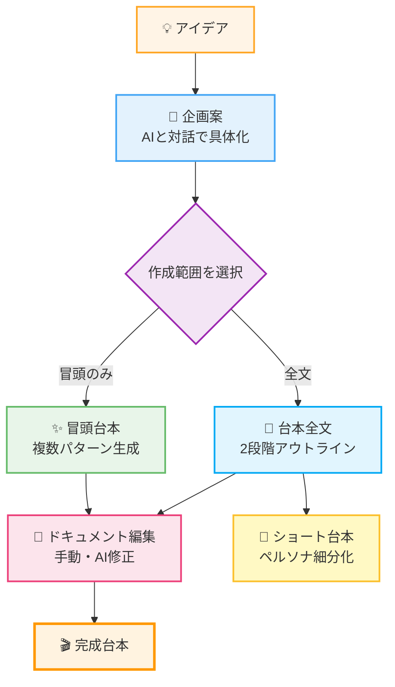
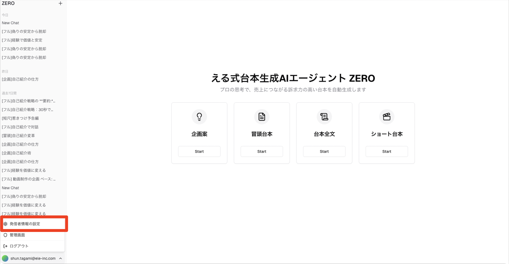
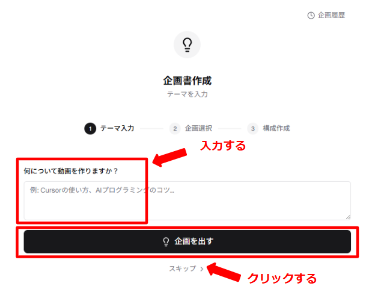
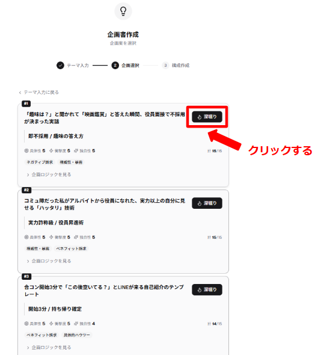
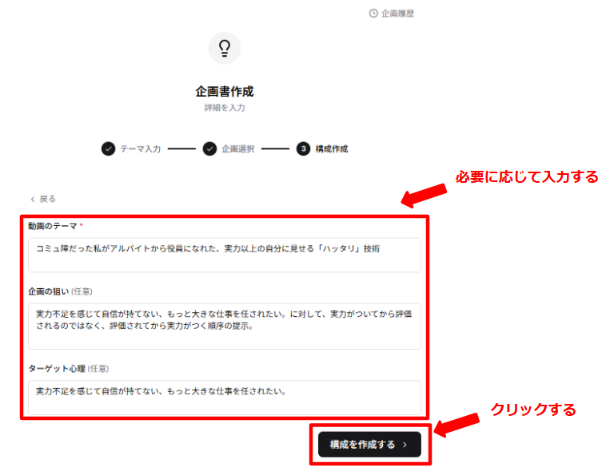
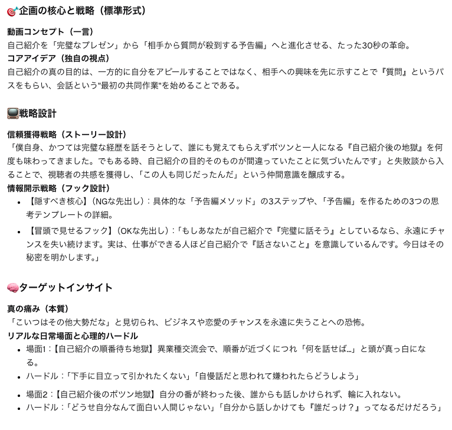
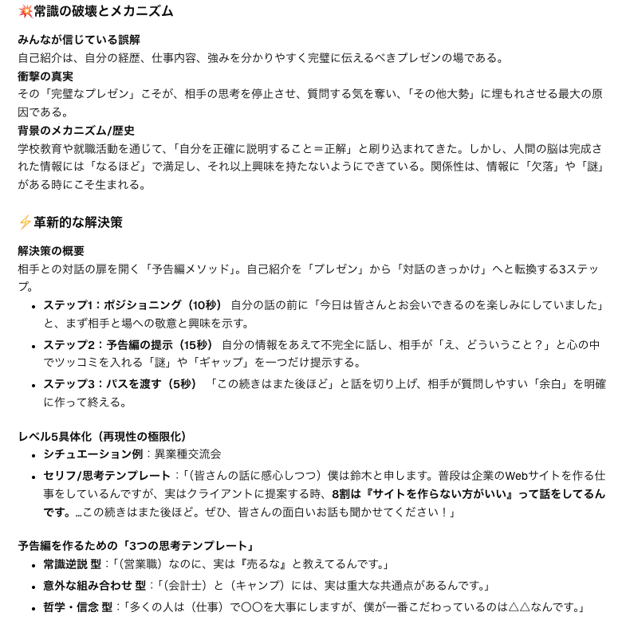
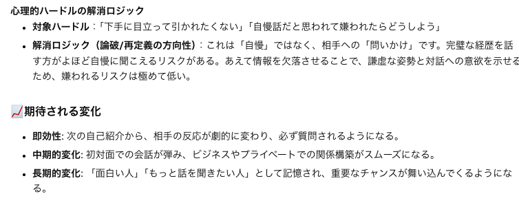
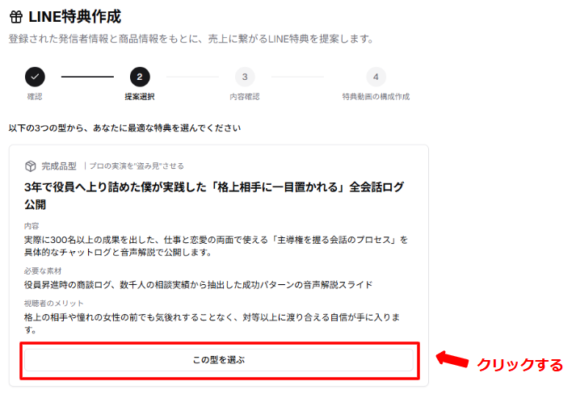

# **える式台本生成AIエージェント ZERO 活用ガイド**

**最終更新日：2026年3月27日**

---

## **本ドキュメントの概要**

「える式台本生成AIエージェント ZERO」の利用方法をまとめたドキュメントです。

**ツールURL:** [https://youtube-content-gen.vercel.app/](https://youtube-content-gen.vercel.app/)

**サポートについて**
マニュアルに記載の有無に関わらず、疑問点・要望など些細なことでもDiscordにてスタッフまでお問い合わせください。

---

## **目次**

- [全体ワークフロー](#全体ワークフロー)
- [初期設定](#初期設定)
- [基本機能](#基本機能)
  - [1. 企画書作成](#1-企画書作成)
  - [2. 台本全文](#2-台本全文)
  - [3. ドキュメント編集](#3-ドキュメント編集)
  - [4. 冒頭台本](#4-冒頭台本)
  - [5. ショート台本](#5-ショート台本)
- [補助機能](#補助機能) — [LINE特典作成](#line特典作成)
- [よくある質問](#よくある質問)

---

## **全体ワークフロー**

```mermaid
graph TB
    A[💡 アイデア] --> B[🤖 企画案<br/>AIと対話で具体化]
    B --> C{作成範囲を選択}
    C -->|冒頭のみ| D[✨ 冒頭台本<br/>複数パターン生成]
    C -->|全文| E[📝 台本全文<br/>2段階アウトライン]
    D --> F[📄 ドキュメント編集<br/>手動・AI修正]
    E --> F
    E --> H[🎥 ショート台本<br/>ペルソナ細分化]
    F --> G[🎬 完成台本]
    style A fill:#fff4e6,stroke:#ffa726,stroke-width:2px
    style B fill:#e3f2fd,stroke:#42a5f5,stroke-width:2px
    style C fill:#f3e5f5,stroke:#9c27b0,stroke-width:2px
    style D fill:#e8f5e9,stroke:#66bb6a,stroke-width:2px
    style E fill:#e1f5fe,stroke:#03a9f4,stroke-width:2px
    style F fill:#fce4ec,stroke:#ec407a,stroke-width:2px
    style G fill:#fff3e0,stroke:#ff9800,stroke-width:3px
    style H fill:#fff9c4,stroke:#fbc02d,stroke-width:2px
```

---

## **初期設定**

ZEROがパーソナライズされた台本を作成するために、以下の情報を設定してください。いずれもマイページから設定できます。

#### **発信者情報の設定（推奨）**

画面左下の**メールアドレス** → 「**発信者情報の設定**」から入力します。

| 項目 | 入力例 |
|------|--------|
| **発信者名** | える |
| **一人称** | 僕 |
| **普段の発信内容** | 仕事でも恋愛でも明日から使えるコミュニケーション術 |
| **ターゲット年代** | 20代〜40代 |
| **ターゲット性別** | 男性 |
| **ターゲットの理想** | 仕事：収入を上げて人生をコントロール / 恋愛：選ぶ側になり素敵なパートナーと出会う |
| **権威性・実績** | ・数千人以上の恋愛相談を解決 ・書籍「イケメンはモテない」25,000部販売 |

#### **商品情報の設定（推奨）**

マイページの「**商品情報**」から入力します。

| 項目 | 入力例 |
|------|--------|
| **年代** | 20代〜40代 |
| **性別** | 男性 |
| **商品のコンセプト** | えるが直接指導をしてあなたのコミュ力を上げてモテる男にする |
| **サポート内容** | マッチングアプリ添削、個別のLINEメッセージ添削、月1回のライブ配信、恋愛・仕事の相談し放題 |

#### **YouTube URLの登録**

マイページの「**YouTube連携**」からURLを貼り付けて「**連携する**」をクリック。

---

## **基本機能**

### **1. 企画書作成**

「このテーマで動画を作りたい」というアイデアを、ZEROとの対話で具体的な企画案にブラッシュアップします。

**STEP 1:** トップメニュー「**企画書作成**」→ テーマを入力 →「**企画を出す**」

**STEP 2:** AIが出した30件の企画案から選択して「**深堀り**」

**STEP 3:** 構成の修正や追加があれば入力し「**構成を作成する**」

**STEP 4:** AIの質問に回答（3〜5回程度）し、動画の「戦略」と「見せ方」を決定

| 見せ方パターン | 詳細 |
|-------------|------|
| **標準形式** | 一つの革新的な解決策を深く掘り下げて解説 |
| **ランキング形式** | 具体的な行動や思考を複数提示し、網羅的に見せる |

**完成イメージ**

| 企画書（1） | 企画書（2） | 企画書（3） |
|-----------|-----------|-----------|
|  |  |  |

[企画作成の実例](https://youtube-content-gen.vercel.app/chat/d3fcf170-1026-40a2-b505-3ffea60da0fa)で過程も確認できます。過去の企画書は右上の「**企画履歴**」から確認できます（30件まで保存）。

---

### **2. 台本全文**

企画案から台本全文をアウトラインを経て生成します。

> **完全自動生成は非推奨** — すべてAIで作ると属人性がなくなり、「再生数は伸びるが売れない」状態になります。必ず自分の考えをAIに投げ、壁打ちしながらブラッシュアップしてください。

**STEP 1:** トップページ「**台本全文**」→ 企画案を入力

**STEP 2:** アウトライン（話の流れの設計図）を確認。ここで方向性を確定させます。

**STEP 3:** 「**✅️アウトラインに合意・台本作成開始**」をクリック（約2-3分）

---

### **3. ドキュメント編集**

生成された台本の編集・推敲・バージョン管理を行います。

> **⚠ 制約**: H1見出し（【タイトル・サムネ】【冒頭】【本編】【エンディング】）は編集できません。その下の内容のみを選択してください。

#### **推奨：AI部分編集**

**1.** 編集したい箇所を**ドラッグ** → **チャットアイコン**をクリック

**2.** 編集指示を入力して送信（例：「もっと簡潔に」）

**3.** AIの変更提案をセクションごとに **承認** / **編集** / **却下**

**4.** すべて確認したら「**これで確定**」

#### **その他の編集方法**

- **手動編集**: 直接テキストを編集 → 「**変更を確定**」。手動編集中はチャット機能が使えません。
- **チャット欄からAI編集**: 通常チャット欄に指示を入力。範囲を指定しないため意図しない箇所が変更されるリスクがあります。具体的に指示してください。
- **変更点の表示**: 画面右上の「**変更点を表示**」アイコンで差分を確認できます。
- **バージョン管理**: 右上の「**前の版を表示**」→「**このバージョンに復元**」で過去の版に戻せます。

---

### **4. 冒頭台本**

異なる訴求パターンで最大3つの冒頭台本を生成します。

1. 左メニュー「**冒頭台本**」→ 台本または企画案（必須）、視聴者の悩み・理想の姿（任意）を入力
2. 「**冒頭台本を作成する**」→ 台本設計を確認 → OKなら「OK」と入力
3. A案・B案・C案から選択

---

### **5. ショート台本**

長尺動画の台本から、ターゲット別のショート動画台本を複数生成します。

1. 「**ショート台本**」をクリック
2. 長尺台本の全文を貼り付け
3. ペルソナ分析を確認 →「OK」と送信
4. 複数のショート台本案を取得

---

## **補助機能**

### **LINE特典作成**

発信者情報と商品情報をもとに、売上に繋がるLINE特典を提案します。事前に[初期設定](#初期設定)を済ませてください。

1. LINE特典作成の「**Start**」→「**提案を生成する**」
2. 3つの提案から「**この型を選ぶ**」
3. 内容を確認・修正し「**保存してチャットへ**」

生成後の修正はチャット欄から指示できます。左下の「**コピー**」で台本をコピーできます。

2回目以降は前回データの上書き、または「**LINE特典**」メニューから前回データを削除して再作成できます。

---

## **よくある質問**

▶ Q. ニューロボルトライティングの構成で生成できますか？

**A.** 固定構成での自動生成は非対応です。テンプレート通りだと視聴者が既視感を持つため、ZEROはテーマに合わせて柔軟に最適化します。

▶ Q. チャット欄から編集指示を出したのに反映されません

**A.** チャット欄からの指示はAIが編集箇所を判定するため、意図しない箇所が変更される可能性があります。台本を範囲選択してから編集指示を出す方法を推奨します。

▶ Q. 台本が1つしか提案されません

**A.** 戦略検討の結果に応じて最大3案を提示する設計です。必要なときのみ複数案が提案されます。

▶ Q. AI編集で意図しない箇所が変更されます

**A.** 却下または手動修正で対応してください。事前にAIへ変更方針を出力させてから編集指示を出すと、意図しない変更を防ぎやすくなります。

