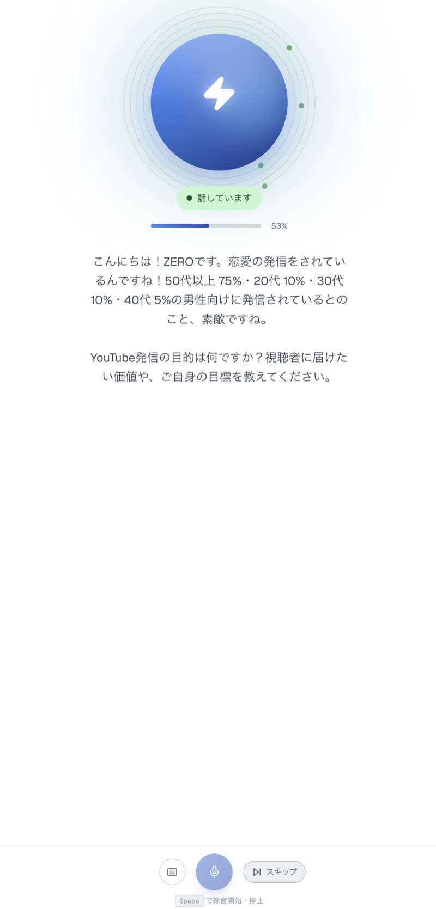
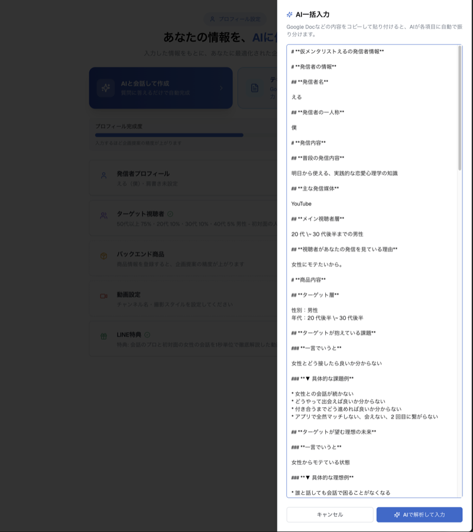
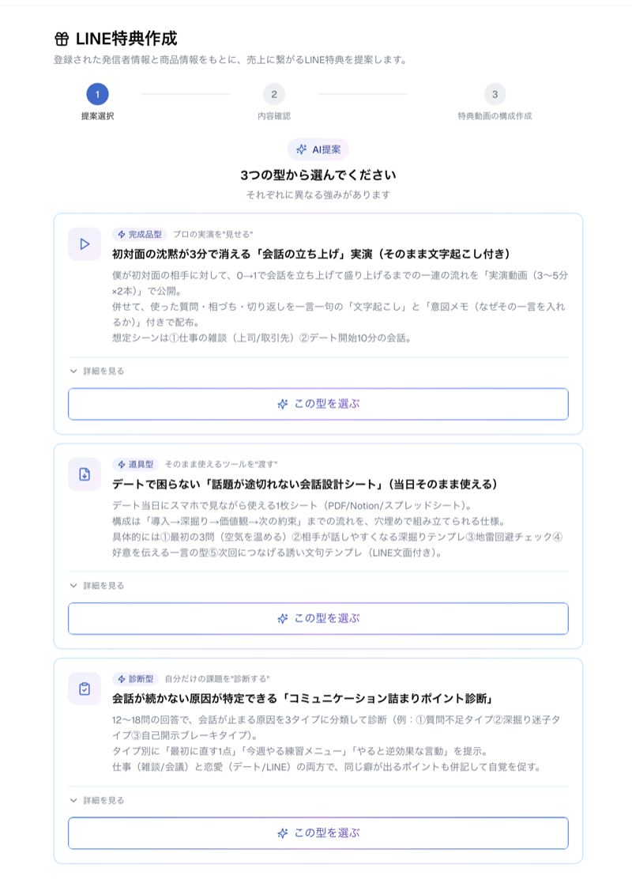
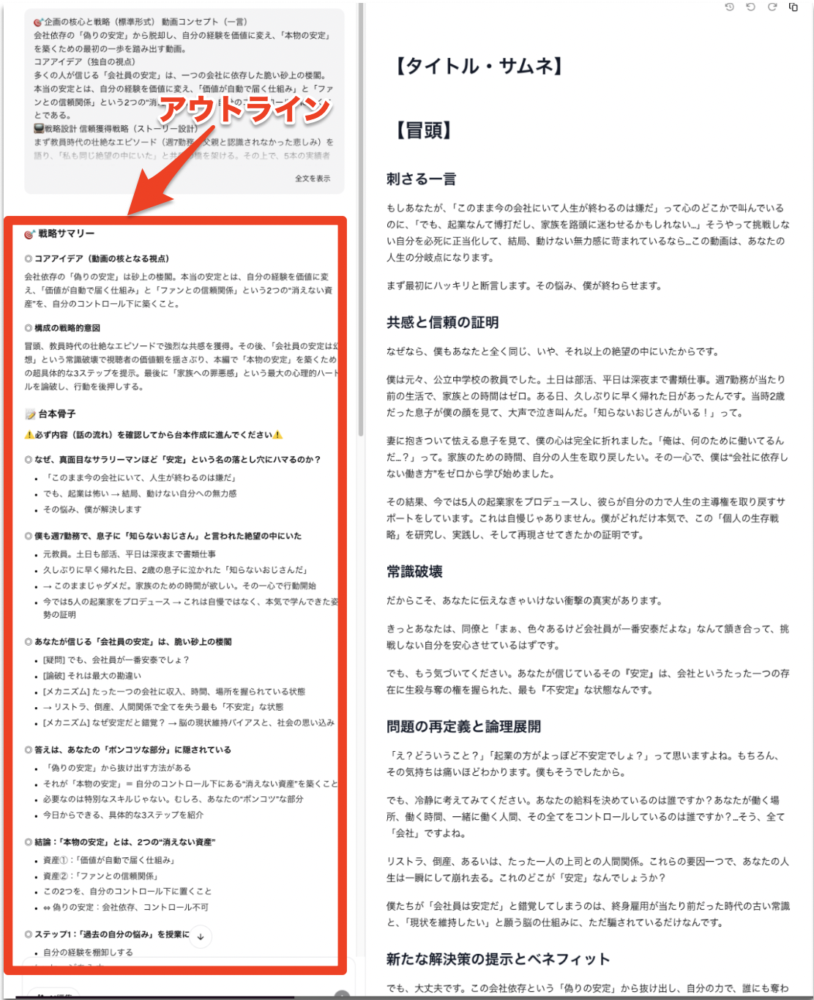
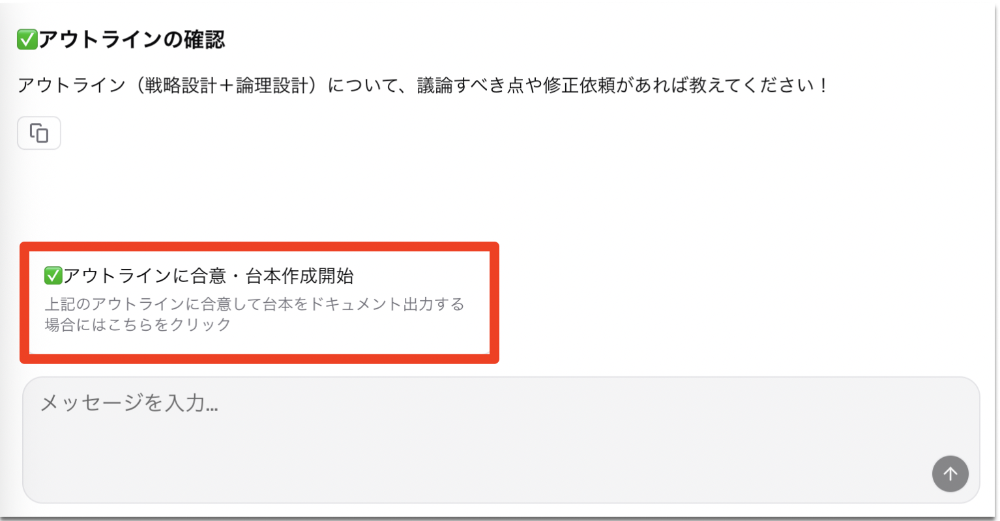
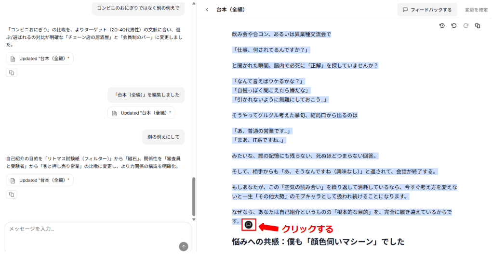
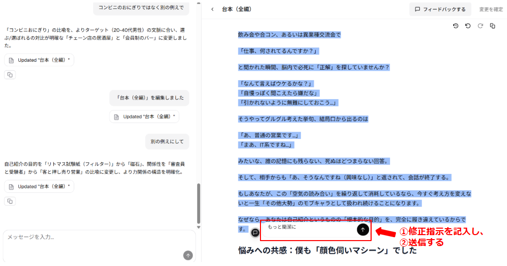
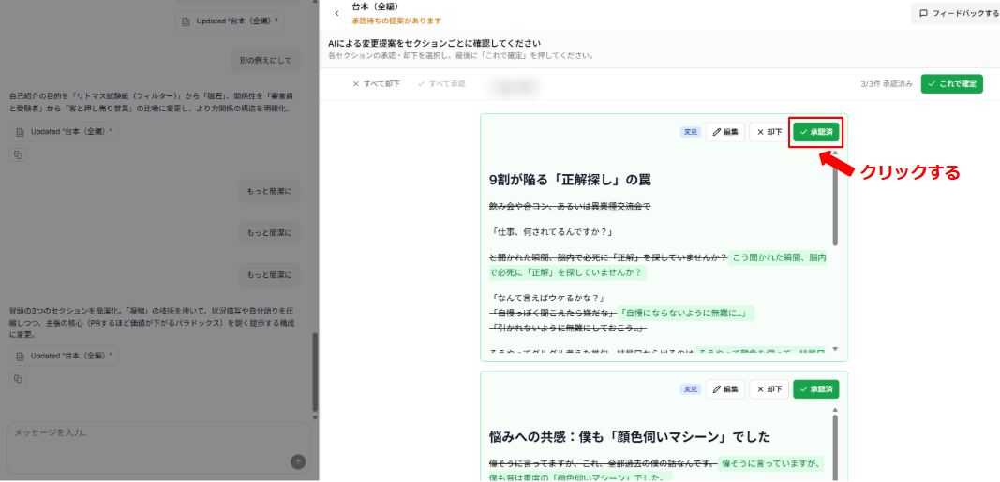
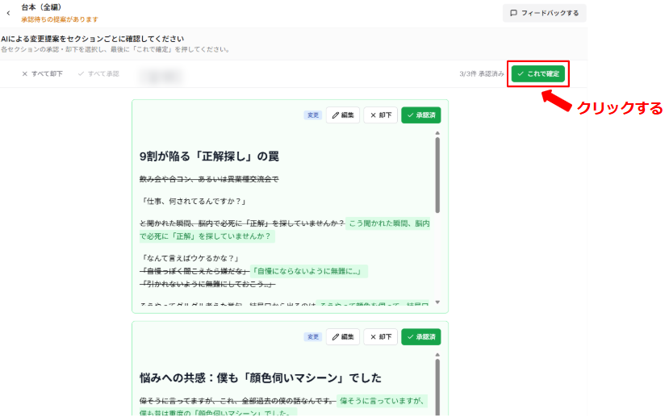

# える式台本生成AIエージェント ZERO 活用ガイド

**最終更新日：2026年3月27日**

---

# ZEROとは

ZEROは、YouTube動画の企画立案から台本完成までをAIと一緒に進めるツールです。

える式の台本設計メソッド（視聴者心理に基づいた構成設計）が組み込まれており、あなたの考えや経験をAIとの対話で台本に落とし込めます。

## 台本完成までの流れ

1. **企画を見つける** — フォームに情報を入力 → AIが市場を調査 → 10個の企画案から選ぶ
2. **台本を生成する** — 選んだ企画から台本全文を自動生成
3. **台本を磨く** — 気になる箇所をAIに修正させて完成

---

# はじめる前に：準備

台本の質を上げるために、2つの準備をしておきましょう。

## 1. プロフィール設定

ZEROがあなた専用の台本を作るための基本情報（発信者情報・商品情報・YouTube連携）を登録します。

マイページを開くと、AIアシスタントが質問しながらプロフィールを完成させる**対話型セットアップ**が利用できます。

### 方法A：AIと音声で対話する（おすすめ）

マイページ → 「**発信者情報を設定しましょう**」→「**はじめる**」→「**音声で話す**」を選択。

AIが質問してくるので、マイクボタン（またはスペースキー）を押して話すだけでプロフィールが埋まっていきます。画面上部のプログレスバーで完了率が確認でき、情報が認識されるたびに緑色の通知で表示されます。

途中でテキスト入力に切り替えることもできます。

### 方法B：AIとテキストチャットで対話する

「**音声で話す**」の代わりに「**テキストで入力**」を選択。チャット形式でAIの質問に答えていきます。

### 方法C：テキストを貼り付けてAIに解析させる

既にプロフィール情報をまとめたテキスト（Google Docなど）がある場合は、マイページの「**AI一括入力**」ボタンからテキストを貼り付けると、AIが各項目に自動で振り分けます。

### 方法D：手動でフォーム入力する

マイページの各セクション（発信者情報・商品情報・YouTube連携）を直接編集することもできます。

## 2. LINE特典の設計

台本の中には視聴者をLINE登録に導くパートがあります。そのため、**台本を作る前に**LINE特典を設計しておくと、導線まで含めた台本が生成されます。

1. 「**LINE特典作成**」→「**Start**」→「**提案を生成する**」
2. 3つの提案から選択 → 内容を確認・修正 →「**保存してチャットへ**」

---

# STEP 1：企画を見つける（企画プランナー）

「何について動画を作ればいいか分からない」という状態からスタートできます。フォームに情報を入力すると、AIが市場調査を行い、データに基づいた10個の企画案を提案してくれます。

## 1-1. ヒアリングフォームに入力する

左メニュー「**企画プランナー**」をクリックすると、ヒアリングフォームが表示されます。チャンネル情報やターゲット、商品情報などを入力してください。

プロフィール設定を済ませていれば「**保存済み情報を読み込む**」で多くの項目が自動で埋まります。

フォームは4つのセクションに分かれています：

| セクション           | 入力する内容                                     |
| -------------------- | ------------------------------------------------ |
| **チャンネル情報**   | チャンネル名、ジャンル、発信内容、目的           |
| **ターゲット**       | 年齢・性別・悩み・理想の状態（最大3ターゲット）  |
| **バックエンド商品** | 商品名、概要、特徴、料金プラン                   |
| **動画設計**         | 一人称、肩書き、実績、撮影スタイル、ベンチマーク |

画面下部に入力進捗バーが表示されます。必須項目をすべて埋めると「**調査を開始する**」が押せるようになります。

<!-- TODO: スクリーンショット（ヒアリングフォーム全体。進捗バーと「調査を開始する」ボタンが見える状態） -->

## 1-2. AIが市場調査を行う（自動・5〜30分）

「**調査を開始する**」を押すと、AIがあなたのジャンルの市場を自動で調査します。

**この間、ページを離れてもOKです。** 戻ってきたら続きから再開できます。

<!-- TODO: スクリーンショット（調査中の画面。スピナーと「調査中...」が表示されている状態） -->

## 1-3. 調査結果を確認する

調査が完了すると、4つのタブで結果を確認できます。

| タブ           | 内容                                                            |
| -------------- | --------------------------------------------------------------- |
| **優先課題**   | 視聴者が抱える悩みの優先ランキング + あなたの強み・NG事項の整理 |
| **インサイト** | 同ジャンルで伸びている動画の共通パターン、季節トレンド          |
| **調査詳細**   | 視聴者の悩み（50件以上）、よくある質問、想定される反論          |
| **参考動画**   | 実際に伸びている動画のタイトル・再生数・チャンネル名            |

確認したら「**企画を作成 →**」をクリックして次に進みます。

<!-- TODO: スクリーンショット（調査結果画面。「優先課題」タブが表示されている状態） -->
<!-- TODO: スクリーンショット（「参考動画」タブ。動画タイトルと再生数が並んでいる状態） -->

## 1-4. 10個の企画案から選ぶ

調査結果をもとに、AIが10個の企画案をスコア付きで生成します。

各企画カードに含まれる内容：

| 項目                 | 説明                                                                 |
| -------------------- | -------------------------------------------------------------------- |
| **順位・スコア**     | 4軸（視聴者ニーズ・競争優位性・クリック率・再現性）で100点満点で採点 |
| **タイトル案**       | 3パターンのタイトル候補                                              |
| **動画の概要**       | 5〜9項目の構成アウトライン                                           |
| **冒頭15秒の入り方** | 視聴者を掴む最初のセリフ                                             |
| **なぜ伸びるのか**   | 調査データに基づいた根拠                                             |

気に入った企画の「**この企画を選択して台本を作成**」をクリックすると、そのままSTEP 2に進みます。

<!-- TODO: スクリーンショット（企画カード。1位の企画が表示されている状態。スコア、タイトル案、「この企画を選択して台本を作成」ボタンが見える） -->

---

# STEP 2：台本を生成する

企画プランナーで選んだ企画の情報が自動で引き継がれ、台本生成が始まります。

## 2-1. アウトラインを確認する

AIが「話の流れ」の設計図（アウトライン）を作成します。修正したい点があればチャットで指示してください。

## 2-2. 台本を生成する

「**✅️アウトラインに合意・台本作成開始**」をクリックすると、約2〜3分で台本全文が生成されます。

---

# STEP 3：台本を磨く（ドキュメント編集）

生成された台本を推敲して完成させます。

## 推奨：範囲を選んでAIに修正させる

**1.** 修正したい箇所を**ドラッグで選択** → **チャットアイコン**をクリック

**2.** 「もっと簡潔に」「具体例を追加して」など指示を入力

**3.** AIの修正提案をセクションごとに **承認** / **編集** / **却下**

**4.** すべて確認したら「**これで確定**」

## その他の編集方法

- **手動編集**: 直接テキストを修正 → 「**変更を確定**」
- **チャット欄からAI編集**: 範囲を指定せず全体に対して指示。意図しない箇所が変わるリスクがあるため、具体的に指示してください。
- **変更点の表示**: 右上の「**変更点を表示**」で差分確認
- **バージョン管理**: 右上の「**前の版を表示**」→「**このバージョンに復元**」で過去の版に戻せます

> **⚠ 制約**: H1見出し（【タイトル・サムネ】【冒頭】【本編】【エンディング】）は現在編集できません。その下の内容を選択して編集してください。

---

# その他の機能

## 冒頭台本

冒頭部分だけを、異なる訴求パターンで最大3つ生成します。「冒頭のインパクトを試したい」ときに便利です。

1. 左メニュー「**冒頭台本**」→ 台本または企画案を入力
2. 台本設計を確認 → OKなら「OK」と入力
3. A案・B案・C案から選択

## ショート台本

長尺動画の台本から、ターゲット別のショート動画台本を複数生成します。

1. 「**ショート台本**」→ 長尺台本の全文を貼り付け
2. ペルソナ分析を確認 →「OK」と送信
3. 複数のショート台本案を取得

## 企画書作成（従来版）

「すでに作りたいテーマが決まっている」場合は、従来の企画書作成も利用できます。AIとチャットで対話しながら企画を練り上げます。

1. トップメニュー「**企画書作成**」→ テーマを入力 →「**企画を出す**」
2. 30件の企画案から選択して「**深堀り**」
3. AIと対話（3〜5回）して企画書を完成

---

# よくある質問

▶ Q. ニューロボルトライティングの構成で生成できますか？

**A.** 固定構成での自動生成は非対応です。テンプレート通りだと視聴者が既視感を持つため、ZEROはテーマに合わせて柔軟に最適化します。

▶ Q. チャット欄から編集指示を出したのに反映されません

**A.** チャット欄からの指示はAIが編集箇所を判定するため、意図しない箇所が変更される可能性があります。台本を範囲選択してから編集指示を出す方法を推奨します。

▶ Q. 台本が1つしか提案されません

**A.** 戦略検討の結果に応じて最大3案を提示する設計です。必要なときのみ複数案が提案されます。

▶ Q. AI編集で意図しない箇所が変更されます

**A.** 却下または手動修正で対応してください。事前にAIへ変更方針を出力させてから編集指示を出すと、意図しない変更を防ぎやすくなります。

