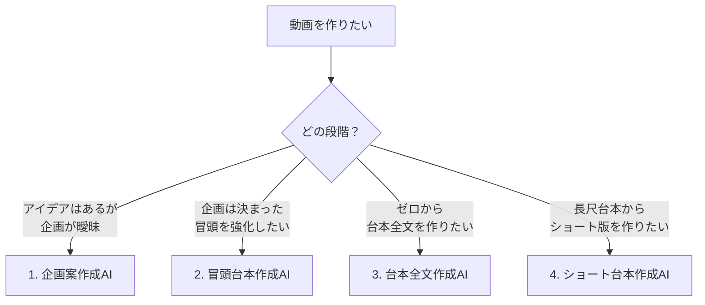

# **える式台本生成AIエージェント ZERO 活用ガイド**

執筆：担当エンジニアSHUN

## **📌 はじめに**

**ツールURL:** [https://youtube-content-gen.vercel.app/](https://youtube-content-gen.vercel.app/)

> **初回アクセス時**  
> ベーシック認証が必要です。別途案内のユーザー名とパスワードを入力してください。

### **ZEROでできる2つのこと**

| 機能 | 用途 | 所要時間 |
|------|------|----------|
| **冒頭生成** | 動画の掴み部分を強化 | 約3分 |
| **台本全文生成** | 冒頭〜エンディングまで作成 | 約10分 |

---

## **📚 目次**

- [初期設定（5分で完了）](#初期設定5分で完了)
- [4つの作成AI機能](#4つの作成ai機能)
- [ドキュメント編集機能](#ドキュメント編集機能)
- [トラブルシューティング](#トラブルシューティング)
- [よくある質問](#よくある質問)

---

## **初期設定（5分で完了）**

### **STEP 1: アカウント作成**

▶ クリックして開く

1. [ツールURL](https://youtube-content-gen.vercel.app/)にアクセス
2. ログイン画面下部の「**新規登録**」をクリック
3. メールアドレスとパスワード（8文字以上）を入力
4. 「**登録**」ボタンで完了（自動ログイン）

| ログイン画面 | 新規登録画面 |
|------------|------------|
|  |  |

### **STEP 2: 発信者情報の設定**

▶ クリックして開く（推奨）

**なぜ必要？**  
AIがあなたの特徴を理解し、パーソナライズされた台本を作成するため

1. 画面左下の**メールアドレス**をクリック
2. 「**マイページ**」ボタンをクリック
3. 以下の項目を入力して「**保存する**」

| 設定画面への入り口 | 設定画面 |
|-----------------|---------|
|  |  |

#### **入力項目と例**

| 項目 | 入力例 |
|------|--------|
| **発信者名** | える |
| **一人称** | 僕 |
| **普段の発信内容** | 仕事でも恋愛でも明日から使えるコミュニケーション術 |
| **ターゲット年代** | 20代〜40代 |
| **ターゲット性別** | 男性 |
| **ターゲットの理想** | 仕事：収入を上げて人生をコントロール 恋愛：選ぶ側になり素敵なパートナーと出会う |
| **権威性・実績** | ・数千人以上の恋愛相談を解決 ・書籍「イケメンはモテない」25,000部販売 |

> 💡 **ポイント**: 詳細に入力するほど精度UP。ただし時間をかけすぎないこと。

---

## **4つの作成AI機能**

### **🎯 機能選択ガイド**

---

### **1️⃣ 企画案作成AI**

▶ 使い方を見る

#### **概要**
アイデアレベルの思いつきを、AIとの対話で具体的な企画に仕上げます。

#### **こんな時に使う**
- 「なんとなくこんな動画を作りたい」状態
- 視聴者の悩みが言語化できていない
- 独自の切り口が見つからない

#### **使用ステップ**

1. **起動**: 左メニュー「**企画案作成AI**」をクリック
2. **入力**: アイデアをチャットで送信
3. **対話**: AIの質問に答える（3〜5回程度）
4. **完成**: 企画案が自動生成される

| 完成イメージ |
|------------|
|  |

#### **実例とデモ**
- [企画作成の実例](https://youtube-content-gen.vercel.app/chat/3e6a4f5b-a42a-42ae-8960-083631875ce7)
- [作成した企画で冒頭を生成](https://youtube-content-gen.vercel.app/chat/07284908-48bc-4942-ad10-50b96914cd0b)

<iframe src="https://www.loom.com/embed/bd9d1294dfbd4ac1a0340b2ad105c52b?sid=912e316d-8677-4efe-bd37-b1237a825d63" frameborder="0" webkitallowfullscreen mozallowfullscreen allowfullscreen style="position: absolute; top: 0; left: 0; width: 100%; height: 100%;"></iframe>

> ⚠️ **注意**: Web検索機能はありません。自分の経験や考えを元に作成します。

---

### **2️⃣ 冒頭台本作成AI**

▶ 使い方を見る

#### **概要**
動画の最初の30秒〜1分を最適化。複数パターンから選択可能。

#### **こんな時に使う**
- 既存台本の冒頭を強化したい
- 企画案から冒頭を生成したい
- 複数の訴求パターンを比較したい

#### **使用ステップ**

##### **STEP 1: 情報入力**
1. 左メニュー「**冒頭台本作成AI**」をクリック
2. 必要情報を入力

| 入力項目 | 説明 |
|---------|------|
| **台本または企画案**（必須） | 既存台本または企画案をコピペ |
| **視聴者の悩み**（任意） | 空欄可（AIが推察） |
| **理想の姿**（任意） | 空欄可（AIが推察） |

| 入力画面 |
|---------|
|  |

##### **STEP 2: 台本設計の確認**
1. 「**冒頭台本を作成する**」をクリック
2. AIが提示する「台本設計」を確認
3. OKなら「OK」と入力、修正なら指示を入力

| 台本設計画面 | 確認返答画面 |
|------------|------------|
|  |  |

##### **STEP 3: パターン選択**
- **A案・B案・C案**から選択
- ボタンクリックで確定、チャット入力で修正可

| 選択画面 |
|---------|
|  |

> ⚠️ **注意**: 「考えています」表示中はリロード厳禁

---

### **3️⃣ 台本全文作成AI**

▶ 使い方を見る

#### **概要**
企画案から台本全文（冒頭〜エンディング）を2段階のアウトラインを経て生成。

#### **こんな時に使う**
- 企画は決まっているが台本がゼロの状態
- 冒頭だけでなく全体を作成したい
- 論理的な構成で台本を作りたい

#### **重要な制約**
> ⚠️ **完全自動生成は不可**  
> 理由：属人性がなくなり「再生数は伸びるが売れない」状態を防ぐため

#### **使用ステップ**

##### **STEP 1: 企画案入力**
1. 左メニュー「**台本全文作成AI**」をクリック
2. 企画案を入力（企画案作成AIからコピペ可）

##### **STEP 2: アウトライン生成（2段階）**

**フェーズ1：戦略設計**
- ターゲット分析と提供価値
- コアアイデア創出
- 全体戦略の選定

**フェーズ2：論理設計**  
- 冒頭パートの設計
- 本編パートの設計
- 行動促進パートの設計

##### **STEP 3: 台本生成**
「**✅この内容で確定・台本生成開始**」をクリック（約2-3分）

| アウトライン確認 | 生成結果 |
|----------------|---------|
|  |  |

> 💡 **Tips**: 企画種別は自動判定。誤判定時はチャットで修正指示。

---

### **4️⃣ ショート台本作成AI**

▶ 使い方を見る

#### **概要**
長尺動画の台本から、ペルソナ別のショート動画台本を複数生成。

#### **こんな時に使う**
- 長尺動画をショート展開したい
- ターゲット別に訴求を変えたい
- 複数のショート動画を効率的に作りたい

#### **使用ステップ**

1. **起動**: 「**ショート台本作成AI**」をクリック
2. **入力**: 長尺台本の全文を貼り付け
3. **分析**: AIのペルソナ分析を確認
4. **生成**: 複数のショート台本案を取得

---

## **ドキュメント編集機能**

▶ 使い方を見る

### **3つの編集方法**

#### **方法1：手動編集**
直接テキストを編集 → 「**保存**」ボタンをクリック

| 手動編集画面 |
|------------|
|  |

#### **方法2：AI編集**

##### **STEP 1: 範囲選択**
編集したい箇所をドラッグ → チャットアイコンをクリック

| 選択前 | 選択後 |
|--------|--------|
|  |  |

##### **STEP 2: 指示入力**
編集指示を入力して送信

| 指示入力 | 処理中 |
|---------|--------|
|  |  |

##### **STEP 3: 差分確認**
「**変更点を表示**」で差分確認

| 確認ボタン | 差分表示 |
|-----------|---------|
|  |  |

##### **STEP 4: 確定/却下**
「**承認**」で反映、「**却下**」で再編集

| 確定画面 |
|---------|
|  |

> ⚠️ **注意**: AIは選択範囲の前後も編集する場合があります

#### **方法3：バージョン管理**
過去のバージョンに切り替え・復元可能

| バージョン切り替え | バージョン復元 |
|------------------|--------------|
|  |  |

---

## **トラブルシューティング**

### **⚠️ AIを使う前に知っておくこと**

| 制限事項 | 対処法 |
|---------|--------|
| **ハルシネーション** | 公開前に事実確認必須 |
| **最新情報なし** | ネット検索不可、トレンド反映なし |
| **長い会話で精度低下** | 新しいチャットを開始 |
| **完璧ではない** | 指示を変えて再試行 |

### **効果的な使い方**

#### ✅ **DO（推奨）**
- 機能を目的別に使い分ける
- 指示は1つずつ明確に
- 定期的に新しいチャットを開始

#### ❌ **DON'T（避ける）**
- 冒頭作成AIで企画相談
- 複数の要求を同時に指示
- 長いやり取りを続ける

### **困ったときは**
Discordのサポートチャンネルでお問い合わせください。

---

## **よくある質問**

▶ Q. ニューロボルトライティングの構成で生成できますか？

**A.** 固定構成での自動生成は非対応です。

**理由**: テンプレート通りだと毎回同じ構成になり、視聴者が既視感を持つため。  
ZEROはテーマに合わせてカスタマイズされた構成を生成します。

---

## **📞 サポート**

- **Discord**: サポートチャンネル
- **対応内容**: ログイン不可、出力停止など
- **返答時間**: 通常24時間以内
